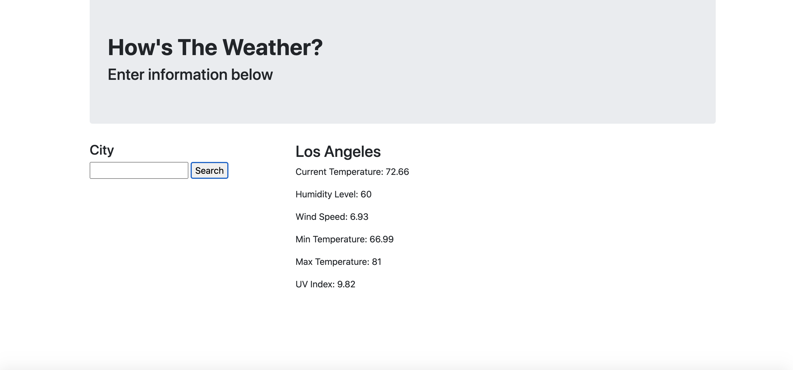

# weatherapplication

This weather application was designed with the intention of pulling specific aspects from OpenWeatherMap.org's API to help users discern the weather conditions present in a specific city.

[My Scheduler](https://cynesthete.github.io/weatherapplication/) is hosted on GitHub pages.

This application was authored by [Tony Rivas](https://cynesthete.github.io).

Author's note: advice and mentorship from Bobbi Tarkany was essential in the creation of this application. I would like to humbly thank her for the advice and guidance in coding and debugging this application. She helped me push and articulate what I had learned in order to make this work properly.